# The Retina

The retina is the part of the eye that converts light into nerve impulses that is sent to the brain through the optical nerve.

Plan
- How light come to the retina
- How the retina convert light to nerve impulses
- Distribution of rods and cones
- What processing is done in the retina
- Why rods cannot help to see colors
- Notes

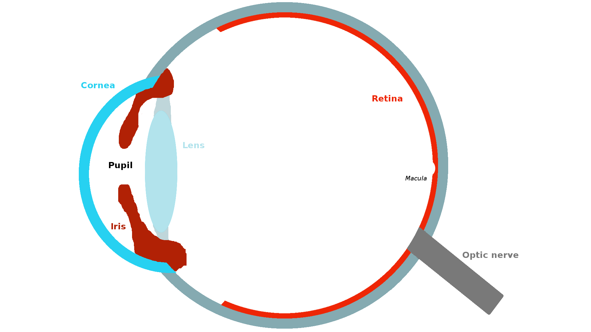

<i>Fig. 1. Eye anatomy </i>

## How light come to the retina
The eye works like a camera. The focus is made by the cornea and the lens. The aperture is controlled by the iris that can reduce or increase the quantity of light coming into the eye. Finally the sensor that convert light into nerve impulses is the retina.

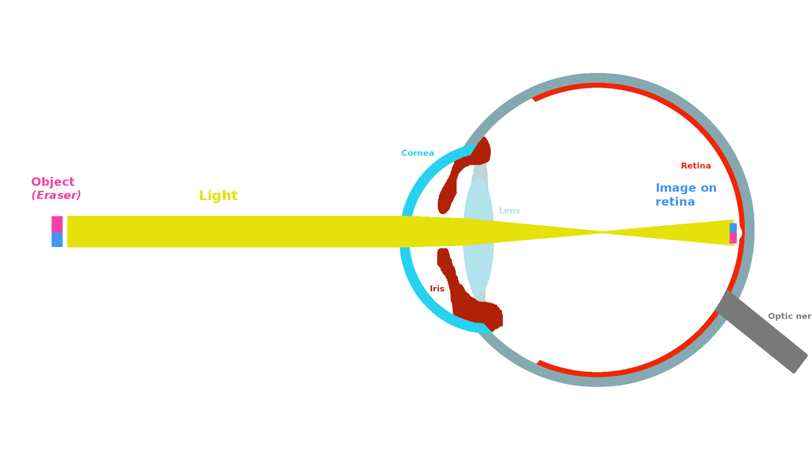

<i>Fig. 2. Light trough the eye </i>

## How the retina convert light to nerve impulses
There are two kind of cells that can convert light into nerve impulses: cones and rods. They are called photoreceptors.

These photoreceptors have photosensitive pigments whose form change when they are striked by light causing a cascade of chemical reactions.

Cones photosensitive pigment is the opsin. There are three kind of opsin that have sensitivity peaks arround 419, 531 and 559 nanometers. Each cone contain mainly one kind of opsin. That is why we distinguish them in three categories: red cones (mainly 559 nm opsin), green cones (431 nm) and blue cones (419 nm).

Rods photosensitive pigment is the rhodopsin with a sensitivity peak arround 500 nanometers.

    <a href="https://thebrain.mcgill.ca/flash/a/a_02/a_02_m/a_02_m_vis/a_02_m_vis.html" rel="some text">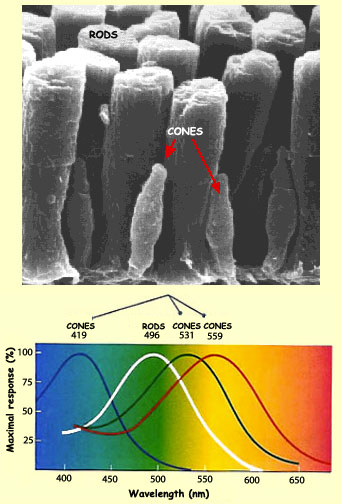</a>

    <i>Fig. 3. Color sensitivity</i>
    

As you may have noticed in the picture above, the red cones maximum sensitivity is more yellow than red however they are the cones with the most sensitivity to the red. That is why another notation is L-cones (long wave cone). The same is true for blue and green cones. They are also referenced as S-cones and M-cones (Short and medium waves cones).

Rods are 1 000 times more light sensitive than cones. That is why under low light condition we mainly use them to see.

External link to go further:
- [phtoreceptor description](https://thebrain.mcgill.ca/flash/d/d_02/d_02_m/d_02_m_vis/d_02_m_vis.html)
- [light to to nerve impulses](https://thebrain.mcgill.ca/flash/i/i_02/i_02_m/i_02_m_vis/i_02_m_vis.html#2)

## Distribution of cones and rods
They are 125 million photoreceptors in the retina: 120 million rods and 5 million cones. However they are not distributed evenly.

There are no rods in the center of the retina, only cones. This region is called fovea. It has a diameter of 1.5 mm and represent a vision angle of 1 degree. This is inside this area that we see things with high resolution and in color.

<a href="" rel="some text">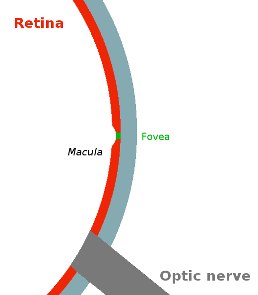</a>

<i>Fig. 4. Fovea inside the macula</i>

The more you get away from the fovea the more rods you have and the less cones there is until 18 degrees. You can see the distribution below:

<a href="https://thebrain.mcgill.ca/flash/i/i_02/i_02_cl/i_02_cl_vis/i_02_cl_vis.html" rel="some text">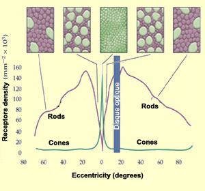</a>

    <i>Fig. 5. Cones/rods densities</i>
    

In the retina they are mainly red and green cone. They are very few blue cones. They are even absent from the center of the fovea.

<a href="https://commons.wikimedia.org/w/index.php?curid=32075732" rel="some text">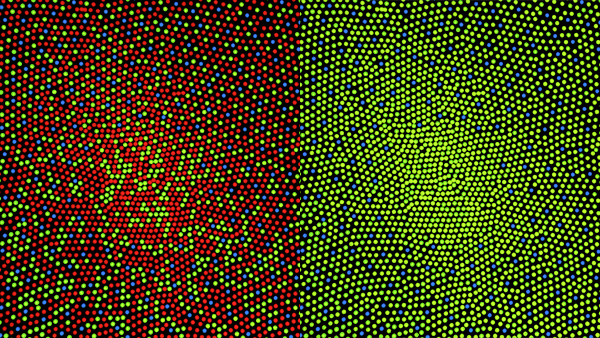</a>

  <i>Fig. 6. Illustration of the distribution of cone cells in the fovea of an individual with normal color vision (left), and a color blind (protanopic) retina.</i>
  By Mark Fairchild, <a href="https://creativecommons.org/licenses/by-sa/3.0" title="Creative Commons Attribution-Share Alike 3.0">CC BY-SA 3.0</a>

##  What processing is done in the retina
Now that the light is converted to nerve impulses by the cones and rods you may think the retina has finished its job and send everything to the optic nerve. It is not the case, there is a preprocessing occuring in the retina with different cells than cones and rods.

They are three main layers in the retina. The one deepest in the retina is the outer segment layer. It contains the photoreceptors (cones and rods).

The second one is the inner nuclear layer. It contains three kind of cells: bipolar cells, horizontal cells and amacrine cells.
- Bipolar cells are connected to one or few cones and rods located close to it.
- Horizontal cells are connected with many rods, cones and bipolar cells. They cause lateral inhibition.
- Amacrine cells have not a yet a clear role. They are connected to bipolar cells.

The last main layer is the ganglion cell layer. It contains ganglionar cells. These cells send their axons to the optic nerve. They are the last cells before the brain. They are connected to bipolar cells and amacrine cells. They convert membrane potential from bipolar cells to action potential that the brain can process.

<a href="https://thebrain.mcgill.ca/flash/i/i_02/i_02_cl/i_02_cl_vis/i_02_cl_vis.html" rel="some text">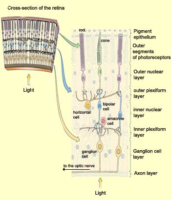</a>

    <i>Fig. 6. Retina layers</i>
    

To get high accuity the ratio of ganglionar cells/photoreceptor should be low. That is why in the fovea one cone is connected to one ganglionar cell trough one bipolar cell. The further you get the more cones and rods are inderctly linked to one ganglionar cell. The receptive fied of a ganglionar cell is increasing while you go far from the fovea.

<a href="https://thebrain.mcgill.ca/flash/i/i_02/i_02_cl/i_02_cl_vis/i_02_cl_vis.html" rel="some text">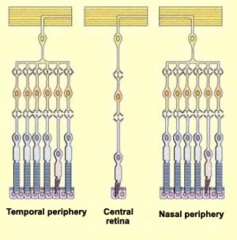</a>

    <i>Fig. 6. Accuity</i>
    

We can divide the receptive field of one bipolar cell into two. A central receptive field containing the photoreceptors direcly connected to the bipolar cell and a peripheral receptive field which contains all photoreceptors relayed by the horizontal cell connected to this bipolar cell.

<a href="https://thebrain.mcgill.ca/flash/i/i_02/i_02_cl/i_02_cl_vis/i_02_cl_vis.html" rel="some text">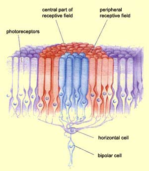</a>

    <i>Fig. 7. Receptive field</i>
    

Near the fovea as one ganglionar cell is connected to one bipolar cell, the receptive field of the ganglionar cell is the same in this area.

When a light spot is hitting only the center of a ganglionar cell receptive field, we see an opposite response than when the light hits the surrounding receptive field.
This lead to two ganglionar cells categories: ON-Centre, OFF-Centre.

<a href="https://thebrain.mcgill.ca/flash/i/i_02/i_02_cl/i_02_cl_vis/i_02_cl_vis.html" rel="some text">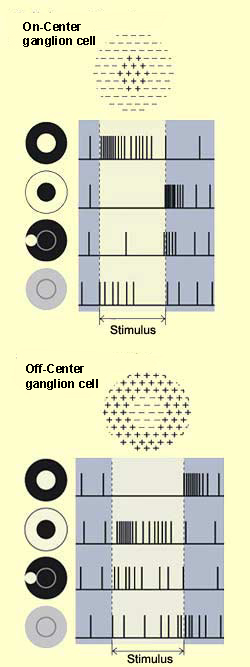</a>

    <i>Fig. 8. Receptive field</i>
    

Note that in the center of the fovea there are nearly no horizontal cells. This imply that there is only a center receptive field without any surrounding. I tried to sum in the diagram below the distribution of all cells according to their position to the center of the retina. (I did not put amacrine cells since I don't have enough info)

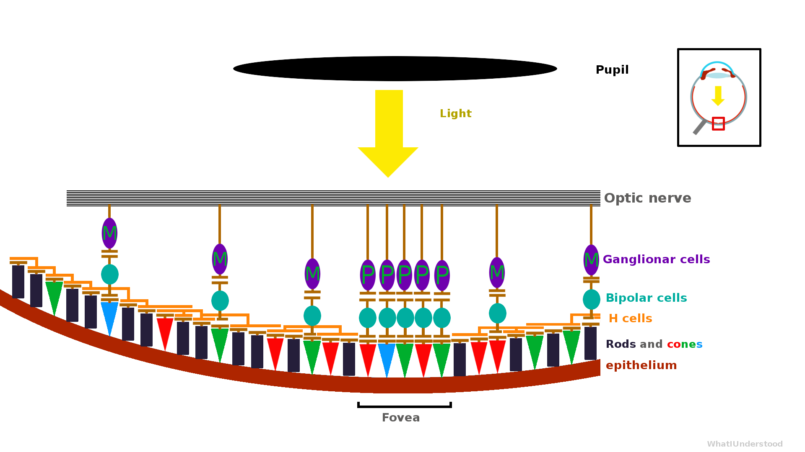

<i>Fig. 9. Retina layers</i>

go further:
- [more](https://thebrain.mcgill.ca/flash/i/i_02/i_02_cl/i_02_cl_vis/i_02_cl_vis.html)

## Why rods cannot help to see colors
Rods like cones have a sensitivity peak arround 500nm. So why they cannot be used to see colors?

The first question to answer is: How cones allow to see colors?

To distinguish colors with cones we need several ganglionar cells to have central receptive field mainly composed with the same photoreceptors (green, red). For example a lot of reds. However if you have only red cones everywhere you can't see colors. You need ON-Green, On-Red intertwined ganglionar cells. In that case you have cells in the same local area that respond differently according to the color!

As you may remember the receptive field in the fovea contains only one cone. So in this area the ganglionar cell is sensitive to color.

When you get further from the fovea you have more and more photoreceptors in the central field. At one point it is impossible to get a majority of one kind of cones. When they are as many red as green cones in the center receptive field then the cell response will be the same with a green or a red light. The ganglionar cell become just an ON/OFF with no color specialisation. It only detects contours and light intensity informations.

If we get back to the rods it become obvious why they cannot detect color. They are located outside the fovea where the receptive fields are large and there are mainly rods that are sensitive to only one wavelength. Under these conditions ganglionar cells are undifferentiated so no color can be distinguished. Only contours and light intensity informations are available.

(incomming picture examples)

## Notes
- The retina is as thick as a cigarette paper
- Classic red/green colour blindness is the result of a lack of red cones in the retina