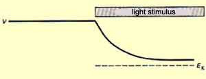
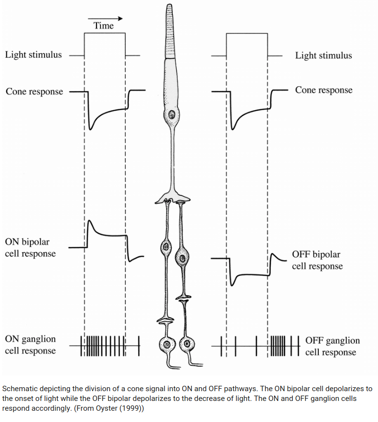
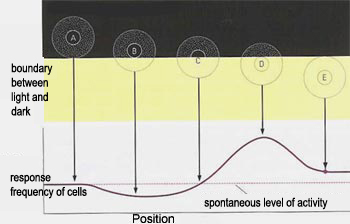
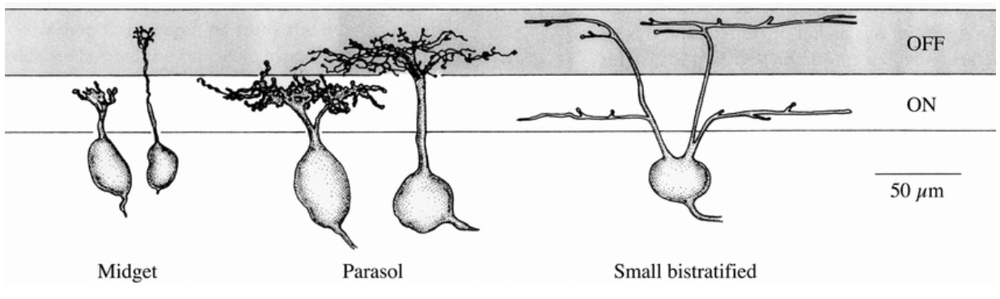
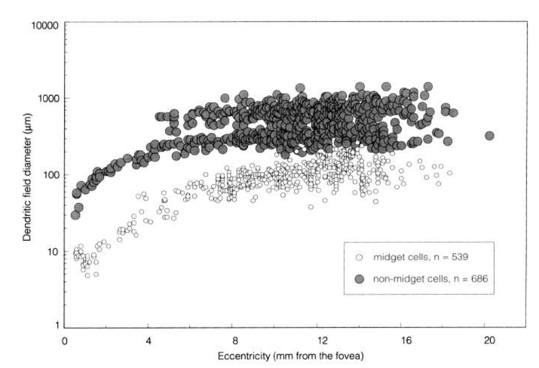
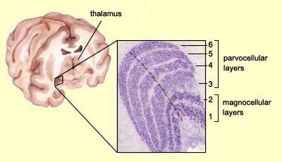

# The Retina

The retina is the part of the eye that converts light into nerve impulses that is sent to the brain through the optical nerve.

Plan
- How light come to the retina
- How the retina capture light
- Distribution of rods and cones
- What processing is done in the retina
- Connection with the brain
- Notes

<i>Fig. 1. Eye anatomy </i>

## How light come to the retina
----------------------------------------
The eye works like a camera. The focus is made by the cornea and the lens. The aperture is controlled by the iris that can reduce or increase the quantity of light coming into the eye. Finally the sensor that converts light into nerve impulses is the retina.

<i>Fig. 2. Light through the eye </i>

## How the retina capture light
----------------------------------------
There are two kinds of cells that can capture light and turn it into potential energy: cones and rods. They are called photoreceptors.

These photoreceptors have photosensitive pigments whose form change when they are struck by light, causing a cascade of chemical reactions leading to a change of the membrane potential.

    

    <i>Fig. 3. Photoreceptor response to stimulus</i>
    

Cones photosensitive pigment is the opsin. There are three kinds of opsin that have sensitivity peaks around 419, 531 and 559 nanometers. Each cone contains mainly one kind of opsin. That is why we distinguish them in three categories: red cones (mainly 559 nm opsin), green cones (431 nm) and blue cones (419 nm).

Rods photosensitive pigment is the rhodopsin with a sensitivity peak around 500 nanometers.

    

    <i>Fig. 4. Color sensitivity</i>
    

As you may have noticed in the picture above, the red cones maximum sensitivity is more yellow than red however, they are the cones with the most sensitivity to the red. That is why another notation is L-cones (long wave cone). The same is true for blue and green cones. They are also referenced as S-cones and M-cones (Short and medium wave cones).

Rods are 1 000 times more light sensitive than cones. That is why under low light condition, we mainly use them to see. As rods are highly sensitive to intensity, they are always saturated in their response and cannot provide color information.

External link to go further:
- [phtoreceptor description](https://thebrain.mcgill.ca/flash/d/d_02/d_02_m/d_02_m_vis/d_02_m_vis.html)
- [light to to nerve impulses](https://thebrain.mcgill.ca/flash/i/i_02/i_02_m/i_02_m_vis/i_02_m_vis.html#2)

## Distribution of cones and rods
They are 125 million photoreceptors in the retina: 120 million rods and 5 million cones. However, they are not distributed evenly.

There are no rods in the center of the retina, only cones. This region is called the fovea. It has a diameter of 1.5 mm and represent a vision angle of 1 degree. This is in this area that we see things with high resolution and in color.

<i>Fig. 5. Fovea inside the macula</i>

The more you get away from the fovea the more rods you have and the less cones there is until 18 degrees. You can see the distribution below:

    <i>Fig. 6. Cones/rods densities</i>
    

In the retina, they are mainly red and green cone. They are very few blue cones. They are even absent from the center of the fovea.

  <i>Fig. 7. Illustration of the distribution of cone cells in the fovea of an individual with normal color vision (left), and a color blind (protanopic) retina.</i>
  By Mark Fairchild, <a href="https://creativecommons.org/licenses/by-sa/3.0" title="Creative Commons Attribution-Share Alike 3.0">CC BY-SA 3.0</a>

##  What processing is done in the retina
----------------------------------------
Now that the light is converted to nerve impulses by the cones and rods you may think the retina has finished its job and send everything to the optic nerve. It is not the case, there is a preprocessing occurring in the retina with different cells than cones and rods. That is why the optic nerve contains only 1.6 million fiber [4] for 125 million photo receptors.

Their are three main layers in the retina. The one deepest in the retina is the outer segment layer. It contains the photoreceptors (cones and rods).

The second one is the inner nuclear layer. It contains three kinds of cells: bipolar cells, horizontal cells and amacrine cells.
- Bipolar cells are connected to one or few cones and rods located close to it.
- Horizontal cells are connected with many rods, cones and bipolar cells. They cause lateral inhibition.
- Amacrine cells have not a yet a clear role. They are connected to bipolar cells.

The last main layer is the ganglion cell layer. It contains ganglionar cells. These cells send their axons to the optic nerve. They are the last cells before the brain. They are connected to bipolar cells and amacrine cells. They convert membrane potential from bipolar cells to action potential (impulses) that the brain can process.

    <i>Fig. 8. Retina layers</i>
    

    <i>Fig. 9. ON OFF pathway (from [3])</i>

To get high acuity the ratio of ganglionar cells/photoreceptor should be low. That is why in the fovea one cone is connected to one ganglionar cell trough one bipolar cell. The further you get, the more cones and rods are indirectly linked to one ganglionar cell. The receptive field of a ganglionar cell is increasing while you go far from the fovea.

    <i>Fig. 10. Accuity</i>
    

We can divide the receptive field of one bipolar cell into two. A central receptive field containing the photoreceptors directly connected to the bipolar cell and a peripheral receptive field which contains all photoreceptors relayed by the horizontal cell connected to this bipolar cell.

    <i>Fig. 11. Receptive field</i>
    

Near the fovea as one ganglionar cell is connected to one bipolar cell, the receptive field of the ganglionar cell is the same in this area.

When a light spot is hitting only the center of a ganglionar cell receptive field, we see an opposite response than when the light hits the surrounding receptive field.
This lead to two ganglionar cells categories: ON-Centre/OFF-surround, OFF-Centre/ON-surround.

    <i>Fig. 12. Receptive field</i>
    

This phenomenon cause colors related responses when the center and the surrounding receptive fields are sensitive to colors.

It also respond to contours as shown in the figure bellow.

    <i>Fig. 13. On-Centre Ganglionar cell response to contours</i>
    

According to their receptive field ganglionar cells (GCs) are split into at least 3 categories.
- Midget cells: they have the smallest receptive field. They represent 80% of GCs. They are often connected to a bipolar cell connected with only one cone. They respond well to red-green or color-opponents stimulation.
- Parasol cells: They have a large responsive field. As so, their center and their surrounding contains a mix of red and green cones in equal proportions that prevent them to differentiate colors. They can only be used to send achromatic information like luminance. They represent 10% of all GCs.
- Bistratified cells: They have a moderate responsive field. This is an intermediate category between midget cells and parasol cells. They are good to compare S cones and L-M averaged cones [4]. They represents 8-10% of GCs.

    <i>Fig. 14. dentric field diameter for ganglionar cells (Popović, Zoran. (2003). Neural limits of visual resolution.)</i>

In the fovea we found mainly midget cells 95% [2](that is why we see very well colors in the center of our vision).

Outside the fovea we find only 45% midget cells [2].

The responsive field from parasol cell seems to be 10 times larger than midget cells according to the graph below taken from [[2](https://www.jneurosci.org/content/jneuro/13/12/5334.full.pdf)] which show the dentric field diameter from non-midget and midget cells.

    <i>Fig. 15. dentric field diameter for ganglionar cells (taken from [2])</i>

go further:
- [the brain from top to bottom](https://thebrain.mcgill.ca/flash/i/i_02/i_02_cl/i_02_cl_vis/i_02_cl_vis.html)
- [wikipedia](https://en.wikipedia.org/wiki/Retinal_ganglion_cell)

## Connection with the brain
----------------------------------------

The main entry point of the GCs axons in the brain is the lateral geniculate nucleus (LGN). 80% of GCs end up there. There are six layers in the LGN and we can see that most of the midget cell ends in the layers 3,4,5,6 and the parasol cell in the 1 and 2.

Layers from 3 to 6 are called parvocellular layers and layers 1,2 are called magnocellular layers.

    <i>Fig. 13. Parvo/Magno cellular layers</i>
    

There is also the Konio pathway which project on the ventral part of each parvo and magno layers. It is less understood than the two other pathways. It can be involved with seasonal mood change. It contains mainly bistratified cells [5].

Ganglionar cells using the parvo pathway can be called P-Type cells. The ones using the magno pathway are called M-Type cells. The same for the K-Type cells using the konio pathway.

P-Type cells contains 80% of midget cells that is why we say that the parvo pathway allow us to see colors. It contains most of the fovea ganglionar cells responses.

M-Type cells represent 10% of all ganglionar cells. They are mainly parasol cell composing m-type cells. It is the magno cellular pathway. It receives achromatic information.

K-Type cells represent 8 to 10% of all ganglionar cells. They are mainly bistratified cells which receive S (blue cones) - LM (red and green) opposition informations.

I tried to sum up in the diagram below the distribution of all cells, according to their position to the center of the retina. (I did not put amacrine cells since I don't have enough info)

<i>Fig. 14. Retina layers</i>

If you want to go the the retina simulation I made follow [The retina modelisation](retina_modelisation.html) (redaction ongoing)

go further:
- [the brain from top to bottom](https://thebrain.mcgill.ca/flash/i/i_02/i_02_cl/i_02_cl_vis/i_02_cl_vis.html)
- [wikipedia](https://en.wikipedia.org/wiki/Retinal_ganglion_cell)

## Notes
----------------------------------------
- The retina is as thick as a cigarette paper
- Classic red/green colour blindness is the result of a lack of red cones in the retina
- foveal position is 11.8° or or 3.4 mm temporal to the optic disk edge
- The area of the human retina is 1,094 mm² [source](https://www.ncbi.nlm.nih.gov/books/NBK11556/)
- Diameter of the macula 3mm [source](https://www.ncbi.nlm.nih.gov/books/NBK11556/)
- fovea fully developed not before 4 years old [source](https://www.ncbi.nlm.nih.gov/books/NBK11556/)
- The field of view of on eye is arround 160° horizontally 175° vertically.

## Biblio
----------------------------------------

[1][the brain from top to bottom](https://thebrain.mcgill.ca/flash/i/i_02/i_02_cl/i_02_cl_vis/i_02_cl_vis.html)

[2] [Dacey, DM. "The mosaic of midget ganglion cells in the human retina." Journal of Neuroscience 13.12 (1993): 5334-5355. Web. 22 Mar. 2020.](https://www.jneurosci.org/content/jneuro/13/12/5334.full.pdf)

[3] [Popović, Zoran. (2003). Neural limits of visual resolution.](https://www.researchgate.net/figure/The-three-main-classes-of-ganglion-cells-Midget-and-parasol-cells-are-unistratified_fig3_267306312)

[4] [Yoonessi A, Yoonessi A. Functional assessment of magno, parvo and konio-cellular pathways; current state and future clinical applications. J Ophthalmic Vis Res. 2011;6(2):119–126.](https://www.ncbi.nlm.nih.gov/pmc/articles/PMC3306093/#)

[5] [Carlos Carvajal, Thierry Viéville, Frédéric Alexandre. Konio Pathway: An Instinctive Visual Mecha-nism for Survival and Decision Making? Oct 2012, Bordeaux, France. hal-00756471](https://hal.inria.fr/hal-00756471/document)

...
