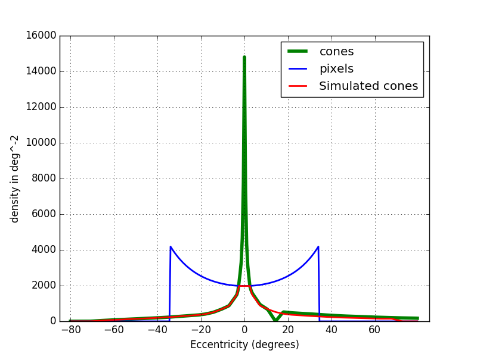

# Retina Modelisation from a Camera
 (redaction ongoing)

This section describe one simulation of human retina from a standard camera (smartphone like cameras). I assume you already have read the page [The retina](retina.html).

Just to recap the context of this simulation, my final goal is to create a biomimetic artificial intelligence using biomimetic sensors (like the retina).

Plan
- Photo receptors simulation
  - Cones inside the Fovea
  - Cones outside the Fovea
  - Simulated cones distribution
  - Pixel limitations
- Bipolar cell modelisation ?
- Ganglionar cells modelisation
  - Midget cells (ongoing)
- Some numbers
- Notes

----------------------------------------------------------
## Photo receptors simulation

As you may remember there are around 125 million photoreceptors in the retina: 120 million rods and between 4 and 5 million cones. As rods are saturated during days, I won't consider them. I will only simulate cones.

We have several technologies to capture light for example the CMOS sensor (complementary metal-oxide semiconductor) which converts light to electrons. I won't detail here how it works but I want to show you the response of the pixels to light. It looks like a lot like cones but the sensitivity peaks are shifted.

    <i>Fig. 1. Pixels sensitivity of one CMOS sensor</i>

    <i>Fig. 2. Cones/rods sensitivity</i>
    

A typical 4K phone camera has a resolution of 8.29 Million RGB pixels (3840 x 2160 x 3). Simulate 5 Million cones with 8.29 Million pixels seems enough, however, it is not.
The main issue is to consider the repartition of the cones inside the retina!

    <i>Fig. 3. Cones/rods densities</i>
    

### Cones inside the Fovea

The fovea area contains approximately 200 000 cones [7] with a field of view around 5°.

We can estimate the diameter of the fovea in 'cones' using the area of a disc.

The fovea has a diameter of $\sqrt(\frac{200.000}{\pi})\times2 \approx 504$ cones which represents $1.5mm$

We need to determine 2 values:
- how many pixel per cones inside the fovea
- how many pixel per cones outside the fovea

Let see how many pixels we have in 5° with a 4K camera from a smartphone.

First I need to find the angular field of view of my smartphone. I could not find mine in the datasheet so estimated it. To do this chose an object, I positioned the camera so that the object took exactly the width of my camera view. Then I used simple trigonometry relations.

    <i>Fig. 4. Camera field of view &alpha;  </i>

\begin{equation}\tan(\frac{\alpha}{2}) = \frac{L}{2D}\end{equation}
 with:
- $\alpha$ being the field of view
- $L$ Object size
- $D$ Distance to Object

from $(1)$ we can deduce that:

\begin{equation}alpha = 2\times\tan(\frac{L}{2D})\end{equation}

With my phone camera, I measured $L = 480 mm$ and $D = 320mm$. This give an horizontal field of view around 74°

To determine the diameter in pixels of 5° at the center of my camera $(p_f)$, I need to use the formula $(3)$ with $alpha_f = 5°$. It gives me 224 horizontal pixels. This means that there are **157 632** pixels in 5° disk ( $\pi\times R^2$ with $R=224/2$ ).

\begin{equation}p_f = \texttt{total_pixels_width}\times\frac{l_f}{L}\end{equation}

with

\begin{equation}l_f = 2\times D\tan(\frac{\alpha_f}{2})\end{equation} $(4)$ deduced from $(1)$.

$l_f$ represent the maximum width of an object at a distance D that can be seen within $\alpha_f$ degrees

To recap, there are 200.000 cones vs 157 632 pixels in the fovea. I can only represent 79% of the cones in the fovea. The overall cone density inside the fovea is 88.880 cones/mm² with the camera we can reach only 70 058 cones/mm² *Here I made the assumption that the density of cones were constant in the fovea however it is not the case. There is an area called FAZ (foveal avascular zone) that has a higher density. I flatten this because the camera is already overwhelmed ...*

### Outside of the fovea

Outside the fovea, the cone density is 10.000 cones per mm². In a surface equivalent to the fovea this represent $\pi \times \frac{1.5}{2}^2*10 000 = 17 671$ cones with a diameter of $\sqrt(\frac{17 671}{\pi})\times2 \approx 150$. The ratio pixels per cone is 8.9

### Simulated cones distribution

As we does not have enough pixels in the fovea I decided to flatten the retina peak and I linearized the transition (for simplicity)

| position      | pixel per cone ratio |simulated density | real cone density         | real max density  |
|:-:            |:-:                   |:-:               |:-:                        |:-:                |
| in fovea      | 0.79                 | 70 058 cones/mm² | 88 888 cones/mm² (avg)    | 150 000 cones/mm² |
| outside fovea | 8.9                  | 10 000 cones/mm² | 10 000 cones/mm² (avg)    | 10 000 cones/mm²  |

    <i>Fig. 3. Simulated Cones density from a 4K camrea with a fov of 74°</i>

### Pixel limitations

In typical cameras, pixels are either triggered at once (global shutter) or line by line (rolling shutter).
In the eye, each photoreceptors can be triggered at any time.

Cameras integrate light over time whereas cones respond to local luminosity changes. If you put your camera still to look one particular area and let it there, all pixels responses will not change until the environment changes. In the same situation the response of the cone will rise and then decrease overtime until it reach 0 millivolts. Thanks to this behaviour, cones react on local changes in intensity. Camera companies are trying to mimic this 'local luminosity' by using the HDR (High Dynamic Range) technology which take several pictures with different exposures and combine them afterward to avoid dark and saturated areas.
*Note: [Event cameras](https://en.wikipedia.org/wiki/Event_camera) may be more biomimetic but they are quite expensive with a low resolution.*

For the similation I have no choice but to ignore these differences.

----------------------------------------------------------

## Bipolar cell modelisation ?
I will directly simulate ganglionar cells response from cones input. I will reproduce the On/Off center behaviour at the ganglionar level. The same is true for H cells.

----------------------------------------------------------

## Ganglionar cells modelisation (redaction ongoing)

All the main ganglionar cells has a similar ON/OFF-center and ON/OFF-surround. The main differences come from their receptive field (I don't consider response time here that can also be different).

I will present the modelization of Midget cells, parasol cells and finally konio cells.

-------------------------
Do Not read below (if you want to keep your mind safe), for the moment it is just notes.
-------------------------

### Midget cells

ON-center midget cells are covering the whole retina without overlap. The same is true for OFF-center midget cells [2].

OFF-center cells have a smaller dentric field and higher cell density (1.7 times more [2]).

| eccentricity (mm) | midget dentric field size $(\mu m)$ | midget dentric field increase factor |
|:-:                |:-:                                  |:-:                                   |
| 0 to 2            | 5-10                                | x 1                                  |
| 2 to 6            | 50-80                               | x 10                                 |
| more              | up to 225                           | x 30 - 40                            |

| eccentricity (mm) | % of midget cells among all GCs | count |
|:-:                |:-:                              |:-:    |
| 0 to 1.5          | 95%                             |       |
| more              | 45%                             |       |

$spacing = 0.1^{(e+1)}$ ? http://www.rctn.org/bruno/psc129/handouts/size-sampling/size-sampling.html
| eccentricity (mm) | spacing | count       |
|:-:                |:-:      |:-:          |
| 0 to 1.5          |         |             |
| 2                 |         |             |
| more              |         |             |

    <i>Tab. 1. Midget dentric field size by eccentricity (Data taken from [2])</i>

 1  x10 x30
<->

    <i>Fig. 4. Center surround modelisation from (www.cns.nyu.edu)</i>

    <i>Fig. 4. Ganglionar cell response(www.cns.nyu.edu)</i>

We have seen that there are mainly different ganglionar cells. Until now I simulated only two of them:
- midget GCs which have a tiny receptive field and mainly goes to the parvo pathway
- parasol GCs which have a larger receptive field and taget the magno pathway

### How many Ganglionar cells
4 millions cones | -> 1.6 million optic nerves [6].

### How many cones per midget cells?
In the fovea it can go from only one to ?

Between 2 and 6 mm eccentricity, midget cells
showed a steep, IO-fold increase in dendritic field size, followed by a more shallow, three- to fourfold increase in the
retinal periphery, attaining a maximum diameter of -225 Am. [4]

### How many cones per parasol cells?

## Notes
- ON cells have 20% larger diameter receptive field than off [3]

- In the central visualfield, 80% of the par-vocellular LGN neurons showed center surround segregation of Land  M  cone  input. [4]

- In the peripheralretina between 20 and 50 degrees of eccentricity, Martin et al.(2001)  found  that  80%  of  tonically  responding,  presumably midget, ganglion cells were opponent.

- tonically responding means constant output under constant illumination. It should be midget cells

- The arrangement of ganglion cells on the retinal surface is not spatially random. Each cell type is distributed in an ordered mosaic. Within each mosaic, cells tend to be spaced apart so as not to occupy a neighboring cell's territory (72). Characteristically, the "nearest neighbor distances" are greater than would be expected of a random distribution. Cells of different types may be closely spaced, however. The mosaics of different cell types are said to be independent. Receptive and dendritic fields of cells within a mosaic partially overlap [5]

- ON- and OFF-center cells appear mutually indifferent to each other's presence and may approach closely without an exclusionary zone. These cell types are said to occupy independent lattices [5]

- Cross-correlations are generated from simultaneous recording of two ganglion cell spike trains. Impulses from the first cell set the zero time around which impulse firing rate histograms for the second cell are generated. The histogram is accumulated for every impulse fired by the first cell. When two neighboring ON-center cells are so paired, a large central peak in firing rate for the second ON cell is seen (Fig. 41, red, left). A similar pattern is seen when two OFF cells are recorded (Fig. 41, blue right). In both cases, increased firing rate represents an increased likelihood that if one cell fires, the other will also. Impulse generation in the two cells is not independent. The cells share common excitatory inputs sources and are likely to be simultaneously excited. [5]

- Ganglion cells develop a high frequency (~100 Hz) oscillatory firing pattern when presented with localized bright stimuli. [5]

| position      | diameter      | field of view ° | cone density |
|:-:            |:-:            |:-:              |:-:           |
| fovea FAZ     | 0.5 mm        | 1.5°            | $150 000/mm2$|
| fovea total   | 1.2 mm        | 5°              |              |
| macula        | ~ 3mm         |                 |              |

| position      | ratio GC/cone |
|:-:            |:-:            |
| 2.2°          | 2:1           |

| diameter | field of view ° |
|:-:       |:-:              |
| 0.5 mm   | 1.5°            |
| 1.2 mm   | 5°              |
| 1.7 mm   | 6°              |
| 5.5 mm   | 17°             |

0.5 mm representing 1.5°

# Biblio

[1][The brain from top to bottom](https://thebrain.mcgill.ca/flash/i/i_02/i_02_cl/i_02_cl_vis/i_02_cl_vis.html)

[2] [Dacey, DM. "The mosaic of midget ganglion cells in the human retina." Journal of Neuroscience 13.12 (1993): 5334-5355.](https://www.jneurosci.org/content/jneuro/13/12/5334.full.pdf)

[3] [Chichilnisky EJ, Kalmar RS. Functional asymmetries in ON and OFF ganglion cells of primate retina. The Journal of Neuroscience : the Official Journal of the Society for Neuroscience. 2002 Apr;22(7):2737-2747. DOI: 10.1523/JNEUROSCI.22-07-02737.2002.](https://www.jneurosci.org/content/jneuro/22/7/2737.full.pdf)

[4] [Diller L, Packer OS, Verweij J, McMahon MJ, Williams DR, Dacey DM. L and M cone contributions to the midget and parasol ganglion cell receptive fields of macaque monkey retina. J Neurosci. 2004;24(5):1079–1088. doi:10.1523/JNEUROSCI.3828-03.2004](https://www.ncbi.nlm.nih.gov/pmc/articles/PMC6793593/)

[5] [Nelson R. Visual Responses of Ganglion Cells. 2001 May 1 [Updated 2007 Apr 10]. In: Kolb H, Fernandez E, Nelson R, editors. Webvision: The Organization of the Retina and Visual System [Internet]. Salt Lake City (UT): University of Utah Health Sciences Center; 1995-.](https://www.ncbi.nlm.nih.gov/books/NBK11550/pdf/Bookshelf_NBK11550.pdf)

[6] [Yoonessi A, Yoonessi A. Functional assessment of magno, parvo and konio-cellular pathways; current state and future clinical applications. J Ophthalmic Vis Res. 2011;6(2):119–126.](https://www.ncbi.nlm.nih.gov/pmc/articles/PMC3306093/#)

[7] [Kolb H. Facts and Figures Concerning the Human Retina. 2005 May 1 [Updated 2007 Jul 5]. In: Kolb H, Fernandez E, Nelson R, editors. Webvision: The Organization of the Retina and Visual System [Internet]. Salt Lake City (UT): University of Utah Health Sciences Center; 1995-.](https://www.ncbi.nlm.nih.gov/books/NBK11556/)