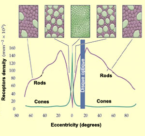
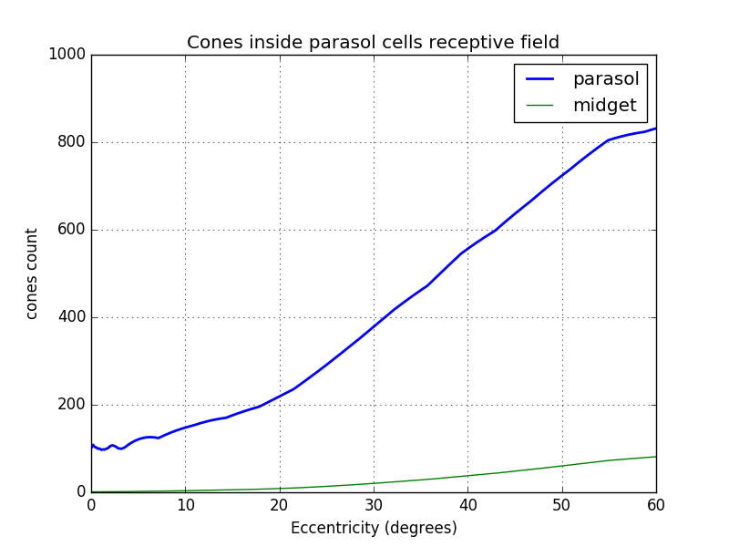

# Retina Modelisation from a Camera

This section describe a simulation of human retina from a standard camera (smartphone like cameras). I assume you already have read the page [The retina](retina.html).
The output of this simulation are two 2D matrices representing the pulses frequencies going through the optic nerve to the brain. These two outputs represent the two pathways in the brain: parvo and magno.

To achieve this, we first convert the pixel image to cones output respecting as much as possible the distribution of the different cones along the eccentricity of the retina.

Then we directly simulate the ganglionar cells frequencies outputs, from the cones result, considering their receptive fields.

Plan

- [Retina Modelisation from a Camera](#retina-modelisation-from-a-camera)
  - [Photo Receptors Simulation](#photo-receptors-simulation)
    - [Pixel density](#pixel-density)
      - [Estimate camera focal and field of view](#estimate-camera-focal-and-field-of-view)
      - [Determine pixel density in $deg^{-2}$](#determine-pixel-density-in-math-xmlns%22httpwwww3org1998mathmathml%22semanticsmrowmidmimiemimsupmigmimrowmo%e2%88%92momn2mnmrowmsupmrowannotation-encoding%22applicationx-tex%22deg-2annotationsemanticsmathdeg%e2%88%922)
    - [Convert cone density in $deg^{-2}$](#convert-cone-density-in-math-xmlns%22httpwwww3org1998mathmathml%22semanticsmrowmidmimiemimsupmigmimrowmo%e2%88%92momn2mnmrowmsupmrowannotation-encoding%22applicationx-tex%22deg-2annotationsemanticsmathdeg%e2%88%922)
    - [Pixel vs Cone density](#pixel-vs-cone-density)
    - [Pixels by cone](#pixels-by-cone)
    - [Cone density integral](#cone-density-integral)
    - [Pixel density integral](#pixel-density-integral)
    - [Link between cone position and pixel position](#link-between-cone-position-and-pixel-position)
    - [Cone distribution simulation](#cone-distribution-simulation)
    - [Cones types simulation (S, L, M)](#cones-types-simulation-s-l-m)
    - [Pixel limitations](#pixel-limitations)
  - [Bipolar cell modelisation ?](#bipolar-cell-modelisation)
  - [Ganglionar cells modelisation (redaction ongoing)](#ganglionar-cells-modelisation-redaction-ongoing)
    - [Ganglionar cell response modelisation](#ganglionar-cell-response-modelisation)
    - [Midget cells](#midget-cells)
      - [Midget cells distribution](#midget-cells-distribution)
      - [Midget Notes](#midget-notes)
      - [Midget cell simulation results](#midget-cell-simulation-results)
    - [Parasol cells](#parasol-cells)
      - [Explanation of parasolReceptiveCones equation:](#explanation-of-parasolreceptivecones-equation)
      - [Parasol cells results](#parasol-cells-results)
      - [Parasol Notes](#parasol-notes)
    - [bistratified cells (ongoing)](#bistratified-cells-ongoing)
  - [Notes](#notes)
  - [Biblio](#biblio)
  - [Annex](#annex)
    - [Conversion of eccentricities in millimeters to degrees](#conversion-of-eccentricities-in-millimeters-to-degrees)

---

## Photo Receptors Simulation

As you may remember there are around 125 million photoreceptors in the retina: 120 million rods and between 4 and 5 million cones. As rods are saturated during the day, I won't consider them here. I will only simulate cones.

Several technologies can capture light, for example the CMOS sensor (complementary metal-oxide semiconductor), which converts light to electrons. I won't detail here how it works but I want to show you the response of the pixels to light. It looks like a lot like cones but the sensitivity peaks are shifted.

    <i>Fig. 1. Pixels sensitivity of one CMOS sensor</i>

    <i>Fig. 2. Cones/rods sensitivity</i>
    

A typical 4K phone camera has a resolution of 8.29 Million RGB pixels (3840 x 2160 x 3). Simulate 5 Million cones with 8.29 Million pixels seems enough, however, it is not.
The main issue is to consider the repartition of the cones inside the retina!

    <i>Fig. 3. Cones/rods densities</i>
    

### Pixel density

The pixel density per mm² is constant in a camera. They form a grid with a constant space between them. This density cannot be directly compared with the cone density because the focal length is not the same in the eye. One solution to get rid of this issue, is to work with densities per degree².

To get the pixel density we need to get the focal length of the camera in pixel units.

#### Estimate camera focal and field of view

If like me, you cannot find the focal length of your camera nor the field of view, you can estimate it with the procedure below.

First, choose an object, put your camera so that the object takes exactly the width of your camera view. Note the values L and D.

    <i>Fig. 4. Camera field of view &alpha;  </i>

Then by using simple trigonometry relations $(1) (2)$ you can determine the field of view $\alpha$

\begin{equation}\tan(\frac{\alpha}{2}) = \frac{L}{2D}\end{equation}
with:

- $\alpha$ being the field of view
- $L$ Object size
- $D$ Distance to Object

from $(1)$ we can deduce that:

\begin{equation}alpha = 2\times\arctan(\frac{L}{2D})\end{equation}

With my phone camera, I measured $L = 480 mm$ and $D = 320mm$. This give an horizontal field of view around 74°.

To get the focal length in pixel unit, just use $(1)$ with L being your pixel width and D your focal.

$f_{pix}=\frac{pixelWidth}{2*\tan(\frac{\alpha_{fov}}{2})}$

with:

- $f_{pix}$ focal in pixel
- $\alpha_{fov}$ fov measured in the previous step

On the 4K camera I found $f_{pix}=2548$ pixels.

#### Determine pixel density in $deg^{-2}$

With the camera focal, in pixels unit, we can estimate the number of pixels along a 1° line, at any eccentricity:

\begin{equation}g(ecc)=f\_{pix}\times(\tan(ecc+0.5)-\tan(ecc-0.5))\end{equation}

with

- $ecc$ eccentricity in degrees
- $f_{pix}$ focal in pixel unit

To get an estimation of the density we just have to square the function above.

\begin{equation}d\_{pix}(ecc)=g(ecc)^{2}\end{equation}

    <i>Fig. 5. Pixel density of a smartphone 4K camera</i>

### Convert cone density in $deg^{-2}$

To compare retinal and camera densities I converted all retinal densities from mm² to degree². To do this I used the polynomial approximation of Andrew B. Watson [10], based on Drasdo and Fowler [11] work.

$a(r_{deg}) = 0.0752 + 5.846\times10^{-5}r_{deg} - 1.064\times10^{-5}r_{deg}^2 +4.116\times10^{-8}r_{deg}^3$

with

- $a$ is the ratio of areas mm2/deg2

By multiplying the cone density by this factor I obtained the figure 6 below. The peak density is around 15 000 cones/deg² and drop to 400 at 20°.

    <i>Fig. 6. Cone density in deg^-2</i>

### Pixel vs Cone density

In the figure below you can see the cone density in the eye and in the camera. The density in the fovea area (5°), is clearly not enough in the 4K camera. However the peripheral area can easily be simulated.

    <i>Fig. 7. Cone and pixel densities in deg^-2</i>

In the fovea area, the camera does not have a density high enough. Here there are two choices: either reuse the same pixel for several cones or drop some cones to match the camera density (cf figure below red curve).

    <i>Fig. 8. Simulated Cones density from a 4K camera with a fov of 74°</i>

### Pixels by cone

To find the number of pixels by simulated cone, we just need to divide the camera pixel density by the simulated cone density (with the fovea flatten). It varies from 1 (fovea) to 22 pixels per cone.

    <i>Fig. 9. Pixels by simulated cone</i>

### Cone density integral

In order to know the number of cones from the center of the fovea to any eccentricity, we can integrate the cone density curve (cf figure below).
I took the values derived from Curcio work [12] provided by [10].
I used only the temporal and nasal cone densities. I have noticed that the fovea diameter in cone is only 340 cones instead of the 500 cones reported by a lot of papers. This difference may come from the data I used which does not represent the average cone distribution (or a mistake in my calculations ^^)...

$I_{cone}(ecc)=\int_{i=0}^{ecc}D_{cone}(i)$

with:

- $D_{cone}(x)$ density of cone by $deg^{-2}$
- $ecc$ eccentricity in $deg$

    <i>Fig. 10. Cone density integral</i>

The curve is flattened around 16° due to the optic nerve.

### Pixel density integral

The pixel density can also be integrated (fig below). Arround 36° the curve flatten because the end of the sensor array has been reached (3680/2 pixels for the 4K camera).

$I_{pixel}(ecc)=\int_{i=0}^{ecc}D_{pixel}(i)$

with:

- $D_{pixel}(x)$ density of pixels by $deg^{-2}$
- $ecc$ eccentricity in $deg$

    <i>Fig. 11. Cone and pixel density integrals</i>

### Link between cone position and pixel position

To convert a cone position to a pixel position we use the function $P()$ below.

$P(coneRadialIndex)=I_{pixel}(I_{cone}^{-1}(coneRadialIndex))$

    <i>Fig. 12. Cones in pixel coordinate</i>

### Cone distribution simulation

    <i>Fig. 13. Raw 4K monochrome image (hfov 74°)</i>

From the image above, the following cone simulation has been made:

    <i>Fig. 14. Simulated cones sampling from a 4K camera (hfov 74°). For this capture, all cones have been simulated even the ones in the fovea, by reusing pixels</i>

### Cones types simulation (S, L, M)

In the previous section, only the cone distribution was considered, not their type: blue, green, red (S,M,L). The proportion of cones inside the retina change a lot between two persons except the blue cones that represent only 5% of them.
For the simulation I choose 70% M-Type cones, 25% L-Type cones and 5% S-Type cones.

For this simulation, the S,M and L types follow a random distribution, respecting the proportion 70%, 25% and 5%. There is a debate on whether or not the cones type distribution is random or not but here I decided to assume the randomness.

For each simulated cone, only one color of the pixel will be used. Red for the L-type cone, Green for the M-type and blue for the S-Type. You can see a representation below:

    <i>Fig. 15. Cones Mapping with 70% M-Type cones, 25% L-Type cones and 5% S-Type cones</i>

    <i>Fig. 16. Zoom on cones mapping with 70% M-Type cones, 25% L-Type cones and 5% S-Type cones</i>

The real cone response is a membrane potential change that decrease rapidly. With the pixel we have a value between 0 and 254 that is stable under constant illumination. I will handle these differences by changing the processing of the upper layer (in next sections).

    <i>Fig. 17. Cones L-Type M-Type and S-Type simulation over a green object. You may notice that a lot of pixels are white because 70% the cones are green cones</i>

    <i>Fig. 18. Cones L-Type M-Type and S-Type simulation over a blue object</i>

I also made a video of the cone simulation. The camera pass over green, blue and red objects.

<iframe width="560" height="315" src="https://www.youtube.com/embed/x0XqHhvJyVA" frameborder="0" allow="accelerometer; autoplay; encrypted-media; gyroscope; picture-in-picture" allowfullscreen></iframe>

    <i>Vid. 1. Cones L-Type M-Type and S-Type simulation over different objects with different colors.</i>

### Pixel limitations

In typical cameras, pixels are either triggered at once (global shutter) or line by line (rolling shutter).
In the eye, each photoreceptors can be triggered at any time.

Cameras integrate light over time whereas cones respond to local luminosity changes. If you put your camera still to look one particular area and let it there, all pixels responses will not change until the environment changes. In the same situation the response of the cone will rise and then decrease overtime until it reach 0 millivolts. Thanks to this behaviour, cones react on local changes in intensity. Camera companies are trying to mimic this 'local luminosity' by using the HDR (High Dynamic Range) technology which take several pictures with different exposures and combine them afterward to avoid dark and saturated areas.
_Note: [Event cameras](https://en.wikipedia.org/wiki/Event_camera) may be more biomimetic but they are quite expensive with a low resolution._

For the similation I have no choice but to ignore these differences.

---

## Bipolar cell modelisation ?

I will directly simulate ganglionar cells response from cones input. I will reproduce the On/Off center behaviour at the ganglionar level. The same is true for H cells.

---

## Ganglionar cells modelisation

Ganglionar cells (GC) are the last cells in the retina. This means the brain receives their outputs.  
Most of the GC have a similar ON/OFF-center and ON/OFF-surround response. The main differences come from their receptive field (I don't consider response time here that can also be different).

To compute a ON-Center ganglionar response, we get the mean cone response in the central receptive field and subsctract it by the mean cone response of the peripheral receptive field.

As the simulated cone response is between 0 and 255, the result of this operation is between -255 and 255. In order to keep a value between 0 and 255 we center the value on 128. The value 0 means that the cell pulse at 0 Hz, the value 255 represent a 100Hz pulsation.

\begin{equation}\frac{1}{2}\times(\frac{\sum\_{x=0}^{n_i} c_i(x)}{n_i}-\frac{\sum\_{x=0}^{n_p} c_p(x)}{n_p})+128\end{equation}

with:

- $n_i,n_p$: total number of inner (or peripheral) cones
- $c_i(x)$: function returning the response from the xth inner cone
- $c_p(x)$: function returning the response from the xth peripheral cone

For an OFF center cell it becomes

\begin{equation}\frac{1}{2}\times(\frac{\sum\_{x=0}^{n_p} c_p(x)}{n_p}-\frac{\sum\_{x=0}^{n_i} c_i(x)}{n_i}) + 128\end{equation}

I use the ratio $\frac{1}{3}$ between the central and the surrounding receptive radius.

To apply this function for each of the three main ganglionar cells (midget, parasol and konio) I need to determine their receptive fields surfaces in cones.

### Midget cells

#### Midget cells distribution

ON-center midget cells are covering the whole retina without overlap. The same is true for OFF-center midget cells [2].
In the fovea there are 2 Ganglionars cells per cones, one ON and one OFF.

To get the cone/midget ratio outside the fovea, I used Andrew B. Watson Midget Retinal Ganglionar Cell Density [10]. This function estimate the midget GC density considering their receptive field location. It is not an easy task because the midget cells have a variable distance with their receptive field.

$density_{midgetf}(r_{deg},k)=2d_c(0)(1+\frac{r_{deg}}{r_m})^{-1}\times[a_k(1+\frac{r_{deg}}{r_{2,k}})^{-2}+(1-a_k)\exp(-\frac{r_{deg}}{r_{e,k}}))]$

with

- $d_c$ cone density per degrees². The fovea density peak is 14 804 cones/deg²
- $r2$ excentricity at which the density is reduced by a factor 4
- $ak$ is the weighting of the first term
- $re,k$ is the scale factor of the exponential
- $k$ represent the meridian
- $r_m$ 41.03°

For the simulation I used only the nasal meridian values given by [10].

- $a=0.9729$
- $r_2=1.084$
- $r_e=7.633$

    <i>Fig. 19. Midget ganglionar cell density (based on their receptive field location)</i>

Now to get the ratio midget GC/cone we divide the curve above by the cone density. We can see that their are 2 midget ganglionar cells per cone in the fovea and then this ratio decrease rapidly. At 30° we have 100 cone per midget cell.

    <i>Fig. 20. Midget ganglionar cell density (based on their receptive field)</i>

As ON-Center and OFF-Center mGCs covers the whole retina, it is possible to assume that one in two is ON and the other OFF. In this situation, the ON-Center mGC density is half of the total mGC density. The same is true for the OFF-Center mGC density. From these assumptions we can estimate the number of cones per midget ganglionar cell (figure below). Near the fovea each ON mGC has exactly one cone and 20 at 30°.

$midgetReceptiveCones(ecc) = 2\times \frac{densityCones(ecc)}{densityMidget(ecc)}$

    <i>Fig. 21. Midget ganglionar cell receptive field cones count</i>

From the number of cones by mGC we can compute the radius in cones of each mGC (cf graph below).

    <i>Fig. 22. Midget ganglionar cell receptive field radius in cone unit</i>

Until now, we considered only the total radius of the mGC receptive field. Some studies [TODO add ref] have shown that there is a ratio of 1/3rd between the central and the peripheral diameter.

#### Midget Notes

Midget cells never have a S cone in their inner area [9] however they can have ones in their outer area.

OFF-center cells have a smaller dentric field and higher cell density (1.7 times more [2]). I did not considered this for now but It could be more interresting because if you keep a ratio of 1.0, the ON and OFF responses are just the opposite, It does not bring additionnal infos.

#### Midget cell simulation results

For the visualisation of the midget ganglionar cell response, I used a colormap (shown in the top left corner of the figure below). If the ganglionar cell has a mean frequency response, the color is blue. The further you get from this value the more red it becomes. By doing this we cannot distinguish high/low reponses. However, as the ON and OFF have identical receptive fields, their response are always opposite. This representation is not perfect but it is the best I have found so far.

As you can notice there is a central disk, it represents the area where one midget cell have only one central cone without any surrounding. Once you cross this area, midget cells responds to L/M oppositions.

    <i>Fig. 23. Midget ganglionar cell response. You can also see the original image and the cone response (top left and bottom left)</i>

Here a video with the mGC response.

<iframe width="560" height="315" src="https://www.youtube.com/embed/H_fmwQq9_Nc" frameborder="0" allow="accelerometer; autoplay; encrypted-media; gyroscope; picture-in-picture" allowfullscreen></iframe>

### Parasol cells

Like midget cells, ON and OFF center parasol cells are covering the whole retina. However, unlike midget cells, parasol cells with the same type (ON or OFF) have their receptive field overlapping [13]. The distance between 2 neighbors cells center of the same type, represent half of their receptive field diameter.

For the parasol cell, I did not find yet a study that shows the continuous distribution. I will use global statistics to approximate this distribution.

|         position          | midget qty | parasol  |
| :-----------------------: | :--------: | :------: |
|           fovea           |    95%     | 5% [13]  |
| outside fovea (up to 50°) |    45%     | 15% [13] |
|     total (up to 50°)     |    80%     |   10%    |

I will assume that the parasol density is a constant fraction of the remaining ganglionar cells that are not midget ones, plus a constant fraction of all ganglionar cells. I have no clues if it is the case.

$density_{parasol}=C\times density_{all}+(density_{all}-density_{midget})\times K$

I find $C$ and $K$ using 2 positions

- at 2.16° where $density_{parasol} = 5\%$ of $density_{all}$
- at 50° where $density_{parasol} = 15\%$ of $density_{all}$

I choose 2.16° because it is at this position that the midget cells represent 95% of all cells.

This gives me $C=0.04$ and $K=0.2$. You can find below the fraction of parasol cell using this values:

    <i>Fig. 23. Parasol ganglionar cell fraction along with midget cell fraction. At 0° the current midget cell model return 100% that is why the sum of parasol and midget fraction are a bit above 100%. Midget density model can be updated later...</i>

Below the density of parasol cells:

    <i>Fig. 23. Parasol ganglionar cell estimated density</i>

From the density, it is possible to estimate the number of cones inside parasol cell receptive field knowing that the distance between 2 neighbors cells of the same type represent half of their receptive field.

$parasolReceptiveCones(ecc) = 8\times \frac{densityCones(ecc)}{densityParasol(ecc)}$

    <i>Fig. 24. Cones in parasol cell receptive field</i>

#### Explanation of parasolReceptiveCones equation:

The density of same type cells (ON or OFF) is $\frac{densityParasol(ecc)}{2}=d_{p2}$. If we divide the cone density by this density we obtain the ratio cones per parasol cells without overlapping. The radius of non overlapping fields can be found with: $R_{nonOverlapping}=\sqrt(\frac{ \frac{densityCones}{d_{p2}}\times \pi\times 0.5^2}{\pi})$. To overlap until the next cell center, $R_{nonOverlapping}$ has to be multiplied by 2. This gives $R_{parasol}=2\times R_{nonOverlapping}$. From this radius, it is possible to get the cone surface of one p-cell: $A_p=\pi R_{parasol}^2$. To get the number of cone we just divide this area by the surface of one cone which is $S_c=\pi 0.5^2$. By combining these results we have

$parasolReceptiveCones(ecc) = A_p/S_c = \frac{\pi R_{parasol}^2}{\pi 0.5^2}$

$parasolReceptiveCones(ecc) = (2\times 2\times R_{nonOverlapping})^2 = 2^4\times  \frac{densityCones}{d_{p2}} \times 2^{-2}$

$parasolReceptiveCones(ecc) = 2^2 \times 2 \times \frac{densityCones(ecc)}{densityParasol(ecc)}$

#### Parasol cells results

Below the output of parasol cells. I am no sure why I have still a bit of chromatic information while the parasol cell should not provide any, due to their larger receptive field.
My explanation is that, due to the large ratio of 70% M cones, it is possible that some parasol cell center have mainly M cones in their center.
So parasol cell do provide a low chromatic information. The other explanation is that the number of cone by parasol cell I found is too low...

    <i>Fig. 24. Parasol output (384x320 pixels representing 30°)</i>

Video on going

#### Parasol Notes

It seems that parasol cells are also sensitive to saptio-temporal changes that are not considered in the simulation yet.

### bistratified cells (ongoing)

S cones have 2 bistratified cells [9] .

## Notes

- ON cells have 20% larger diameter receptive field than off [3]. I did not simulate this for now.
- Midget ganglionar cell receptive field is ellipsoidal [15]. You can see images in [15]. [16] have a representation of midget, parasol and bistratified ganlionar cells surfaces.
- [16] Talk aslo about the 17 ganglionar cells types: midget, parasol, sparse, giant sparse, smooth, Recursive, Broad thorny, thorny, bistratified recursive, bistratified large, bistratified small...

- In the central visualfield, 80% of the par-vocellular LGN neurons showed center surround segregation of Land M cone input. [4]

- In the peripheralretina between 20 and 50 degrees of eccentricity, Martin et al.(2001) found that 80% of tonically responding, presumably midget, ganglion cells were opponent.

- tonically responding means constant output under constant illumination. It should be midget cells

- The arrangement of ganglion cells on the retinal surface is not spatially random. Each cell type is distributed in an ordered mosaic. Within each mosaic, cells tend to be spaced apart so as not to occupy a neighboring cell's territory (72). Characteristically, the "nearest neighbor distances" are greater than would be expected of a random distribution. Cells of different types may be closely spaced, however. The mosaics of different cell types are said to be independent. Receptive and dendritic fields of cells within a mosaic partially overlap [5]

- ON- and OFF-center cells appear mutually indifferent to each other's presence and may approach closely without an exclusionary zone. These cell types are said to occupy independent lattices [5]

- Cross-correlations are generated from simultaneous recording of two ganglion cell spike trains. Impulses from the first cell set the zero time around which impulse firing rate histograms for the second cell are generated. The histogram is accumulated for every impulse fired by the first cell. When two neighboring ON-center cells are so paired, a large central peak in firing rate for the second ON cell is seen (Fig. 41, red, left). A similar pattern is seen when two OFF cells are recorded (Fig. 41, blue right). In both cases, increased firing rate represents an increased likelihood that if one cell fires, the other will also. Impulse generation in the two cells is not independent. The cells share common excitatory inputs sources and are likely to be simultaneously excited. [5]

- Ganglion cells develop a high frequency (~100 Hz) oscillatory firing pattern when presented with localized bright stimuli. [5]

- How many Ganglionar cells: 4 millions cones -> 1.6 million optic nerves [6].

- Midget cell receptive radius:
  Between 2 and 6 mm eccentricity, midget cells
  showed a steep, IO-fold increase in dendritic field size, followed by a more shallow, three- to fourfold increase in the
  retinal periphery, attaining a maximum diameter of -225 Am. [4]

|  position   | diameter | field of view ° | cone density  |
| :---------: | :------: | :-------------: | :-----------: |
|  fovea FAZ  |  0.5 mm  |      1.5°       | $150 000/mm2$ |
| fovea total |  1.2 mm  |       5°        |               |
|   macula    |  ~ 3mm   |                 |               |

| position | ratio GC/cone |
| :------: | :-----------: |
|   2.2°   |      2:1      |

| diameter | field of view ° |
| :------: | :-------------: |
|  0.5 mm  |      1.5°       |
|  1.2 mm  |       5°        |
|  1.7 mm  |       6°        |
|  4.5 mm  |       18°       |

| eccentricity (mm) | midget dentric field size $(\mu m)$ | midget dentric field increase factor |
| :---------------: | :---------------------------------: | :----------------------------------: |
|      0 to 2       |                5-10                 |                 x 1                  |
|      2 to 6       |                50-80                |                 x 10                 |
|       more        |              up to 225              |              x 30 - 40               |

    <i>Tab. 1. Midget dentric field size by eccentricity (Data taken from [2])</i>

Cone diameter varies from 0.5 to 4.0 µm

Cone pedicles are large, conical, flat end-feet (8-10 µm diameter) [8]

S-Cone remains isolated to the ganglion cell level too, due to connections with a specific ‘S-cone bipolar cell [8]

## Biblio

[1\][The brain from top to bottom](https://thebrain.mcgill.ca/flash/i/i_02/i_02_cl/i_02_cl_vis/i_02_cl_vis.html)

[2\][Dacey, DM. "The mosaic of midget ganglion cells in the human retina." Journal of Neuroscience 13.12 (1993): 5334-5355.](https://www.jneurosci.org/content/jneuro/13/12/5334.full.pdf)

[3\][Chichilnisky EJ, Kalmar RS. Functional asymmetries in ON and OFF ganglion cells of primate retina. The Journal of Neuroscience : the Official Journal of the Society for Neuroscience. 2002 Apr;22(7):2737-2747. DOI: 10.1523/JNEUROSCI.22-07-02737.2002.](https://www.jneurosci.org/content/jneuro/22/7/2737.full.pdf)

[4\][Diller L, Packer OS, Verweij J, McMahon MJ, Williams DR, Dacey DM. L and M cone contributions to the midget and parasol ganglion cell receptive fields of macaque monkey retina. J Neurosci. 2004;24(5):1079–1088. doi:10.1523/JNEUROSCI.3828-03.2004](https://www.ncbi.nlm.nih.gov/pmc/articles/PMC6793593/)

[5\][Nelson R. Visual Responses of Ganglion Cells. 2001 May 1 [Updated 2007 Apr 10]. In: Kolb H, Fernandez E, Nelson R, editors. Webvision: The Organization of the Retina and Visual System [Internet]. Salt Lake City (UT): University of Utah Health Sciences Center; 1995-.](https://www.ncbi.nlm.nih.gov/books/NBK11550/pdf/Bookshelf_NBK11550.pdf)

[6\][Yoonessi A, Yoonessi A. Functional assessment of magno, parvo and konio-cellular pathways; current state and future clinical applications. J Ophthalmic Vis Res. 2011;6(2):119–126.](https://www.ncbi.nlm.nih.gov/pmc/articles/PMC3306093/#)

[7\][Kolb H. Facts and Figures Concerning the Human Retina. 2005 May 1 [Updated 2007 Jul 5]. In: Kolb H, Fernandez E, Nelson R, editors. Webvision: The Organization of the Retina and Visual System [Internet]. Salt Lake City (UT): University of Utah Health Sciences Center; 1995-.](https://www.ncbi.nlm.nih.gov/books/NBK11556/)

[8\][webvision.med.utah.edu, Part II Anatomy and Physiology of the retina](https://webvision.med.utah.edu/book/part-ii-anatomy-and-physiology-of-the-retina/photoreceptors/)

[9\][Ahmad K. M. Klug K. Herr S. Sterling P. Schein S. (2003). Cell density ratios in a foveal patch in macaque retina. Visual Neuroscience, 20 (2), 189– 209](https://www.ncbi.nlm.nih.gov/pubmed/12916740)

[10\][Andrew B. Watson; A formula for human retinal ganglion cell receptive field density as a function of visual field location. Journal of Vision 2014;14(7):15. doi: https://doi.org/10.1167/14.7.15.](https://jov.arvojournals.org/article.aspx?articleid=2279458)

[11\][Drasdo N. Fowler C. W. (1974). Non-linear projection of the retinal image in a wide-angle schematic eye. British Journal of Ophthalmology, 58 (8), 709– 714.](http://www.ncbi.nlm.nih.gov/pubmed/4433482)

[12\][Curcio, C. A., Sloan, K. R., Kalina, R. E., & Hendrickson, A. E. (1990). Human photoreceptor topography. The Journal of Comparative Neurology, 292(4), 497–523. doi:10.1002/cne.902920402](https://www.ncbi.nlm.nih.gov/pubmed/2324310)

[13\][D.W. Marshak, in Encyclopedia of Neuroscience, 2009](https://www.sciencedirect.com/topics/biochemistry-genetics-and-molecular-biology/parasol-cell)

[14\][M. B.Manookin, S. PattersonNeural Mechanisms Mediating Motion Sensitivity in Parasol Ganglion Cells of the Primate Retina, 2018](https://www.sciencedirect.com/science/article/pii/S0896627318301053)

[15\][Watanabe, M., and Rodieck, R. W. (1989). Parasol and midget ganglion cells of the primate retina. J. Comp. Neurol. 289, 434–454. doi: 10.1002/cne.902890308](https://onlinelibrary.wiley.com/doi/abs/10.1002/cne.902890308)

[16\][Field, G. D., and Chichilnisky, E. J. (2007). Information processing in the primate retina: circuitry and coding. Annu. Rev. Neurosci. 30, 1–30. doi: 10.1146/annurev.neuro.30.051606.094252](https://www.annualreviews.org/doi/pdf/10.1146/annurev.neuro.30.051606.094252)

[17\][Popović, Zoran. (2003). Neural limits of visual resolution.](https://www.researchgate.net/figure/The-three-main-classes-of-ganglion-cells-Midget-and-parasol-cells-are-unistratified_fig3_267306312)

[18\][Carlos Carvajal, Thierry Viéville, Frédéric Alexandre. Konio Pathway: An Instinctive Visual Mecha-nism for Survival and Decision Making? Oct 2012, Bordeaux, France. hal-00756471](https://hal.inria.fr/hal-00756471/document)

[??\][Greene G, Wachtler T and Gollisch T (2011). A model of retinal ganglion cell processing under natural viewing conditions.. Front. Comput. Neurosci. Conference Abstract: B C11 : Computational Neuroscience & Neurotechnology Bernstein Conference & Neurex Annual Meeting 2011. doi: 10.3389/conf.fncom.2011.53.00224](https://www.frontiersin.org/articles/10.3389/fnana.2015.00122/full)

## Annex

### Conversion of eccentricities in millimeters to degrees

I used the formula $(A5)$ from [10]

$r_{mm}(r_{deg}) = 0.268r_{deg}+0.0003427r_{deg}^2-8.3309\times10^{-6}r_{deg}$ $(A5)$

with $r_{mm}$ being the distance in mm² and $r_{deg}$ being the equivalent in degree
